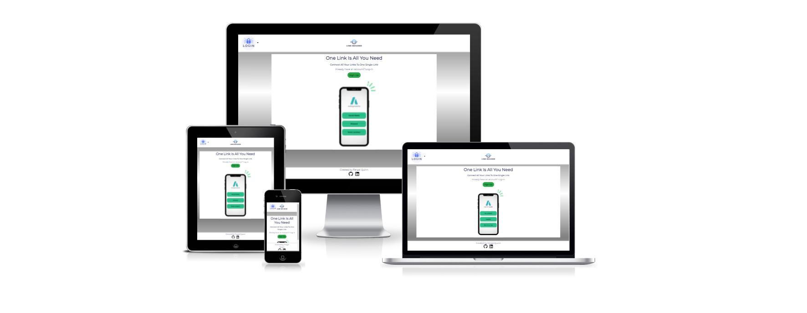
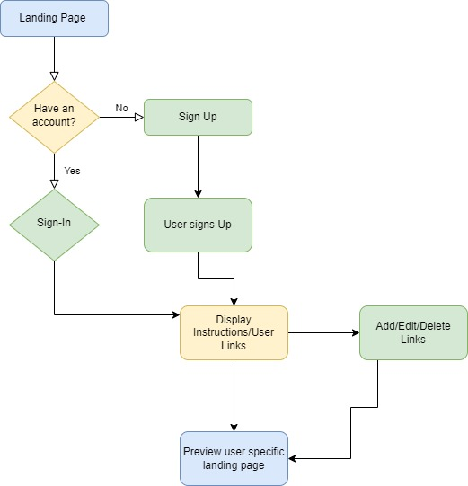
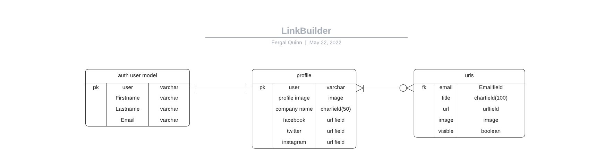
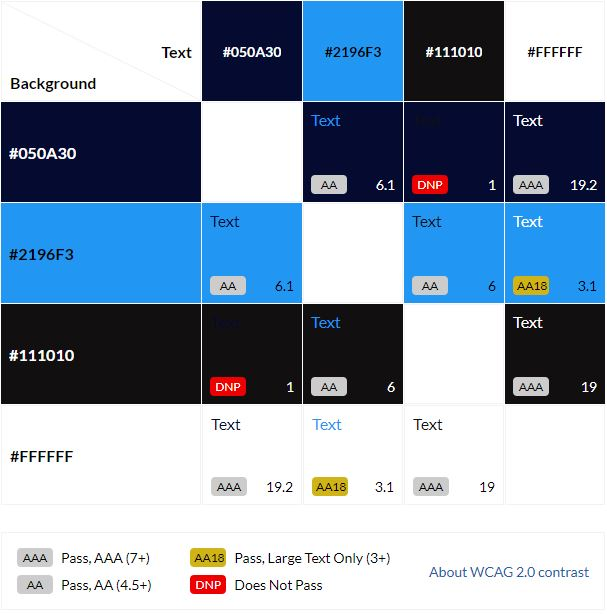
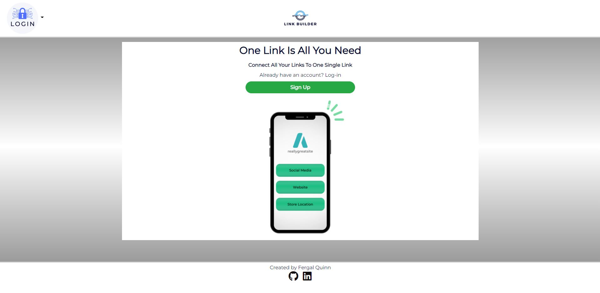
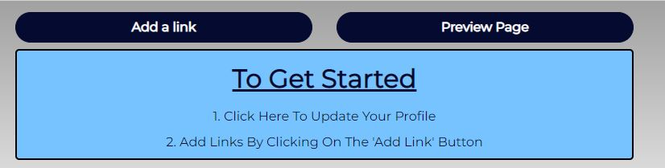
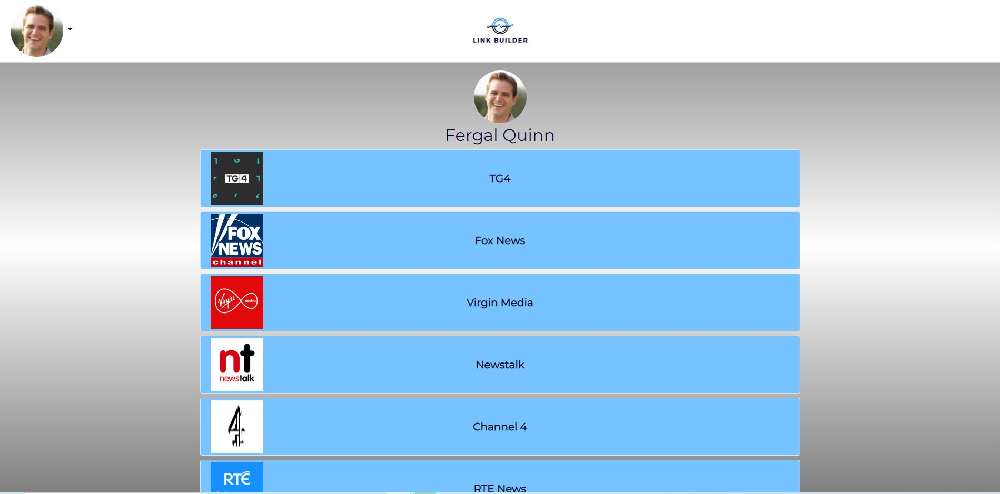
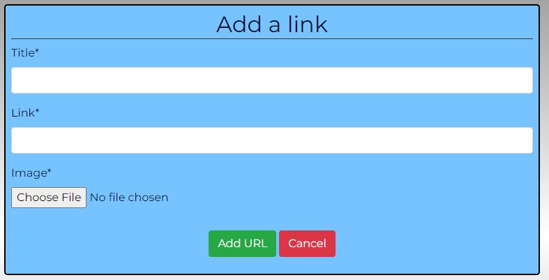
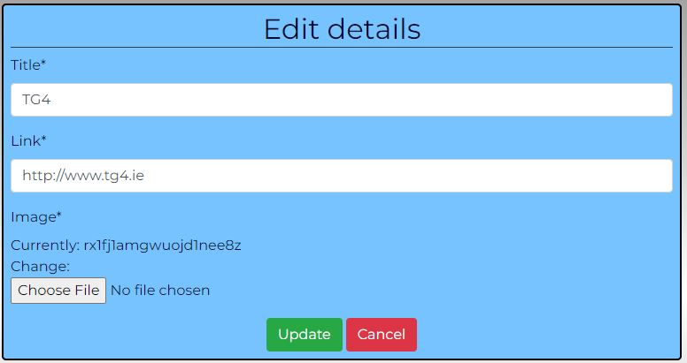
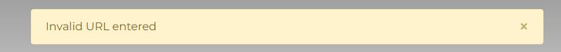

# **Link Builder**
This project is based on the LinkTree web application concept. Companies and individuals often require one URL link to contain information/links for many other sites. In particular, Instagram allows users to have one link in Bio.

Link Builder allows users create one landing link (https://www.linkbuilder.com/username) which displays all the users links.

[Deployed site](https://ci-fq-linktree-p4.herokuapp.com/)

# **Planning Phase**
## **Strategy** 
### **Site Aims:**

Companies often have many links they need to be displayed to customers. However some platforms like Instagram restrict the number of URL's that can be included in their Bio.

This app aims to provide a user and simple interface that allows them to use one single link that contains many other links.

### Brainstorming:

My brother and I work in the licenced trade and have a number of venues that regularly use social media. We brainstormed what features we would find useful and have detailed these below.

### Opportunities:
There was awide range of features I came up with during our brainstorming session for this site. I used a feasibility chart to narrow them down and prioritize the scope of the intended strategy. 

Opportunity | Importance | Viability/Feasibility
---|---|---
Add/Edit/Delete links | 5 | 5
User can toggle between hide/show links | 5 | 5
User can have a unique landing page to display links | 5 | 5
User can drag and drop links to re-order | 5 | 3
Set up their profile including picture and social media links | 4 | 5 
User can review stats on how many times each link is clicked | 3 | 1
Set up a schedule for the links to be displayed | 3 | 2
----------------------------------------|----|----
Totals | 30 | 26 

Viability and feasibility in the above table are based on both time and current level of ability using different languages/frameworks. 

## **Scope**

Due to the imbalance in scores above, there will be some trade-offs. However, I anticipate that some further trade-offs will need to be made later due to the time set for this project. 

I have further divided this table into three categories to help prioritize the order of importance and clarify the MVP required to launch as a basic proof of concept while meeting the above objective. These three categories are:-
* UX efforts **must** address these:
    * Add/Edit/Delete links.
    * User can have a unique landing page to display links.
    * Set up their profile including picture and social media links.

* UX efforts **should** accommodate these:
    * User can toggle between hide/show links.

* **Unwise** use of time to address there:
    * User can drag and drop links to re-order.
    * User can review stats on how many times each link is clicked.
    * Set up a schedule for the links to be displayed.

## **Structure**   
To help me visualize a typical user journey around the site, I used [draw.io](https://app.diagrams.net/) to help me plan out the various routes a user could take through the site.

### **User Stories:**  

* As an **Admin** I can...
    * **Access the admin interface** so that **Manually edit user and link details**    
    * ... **Filter and search all users from the admin page** so that **I can utilize the admin page to review, edit and delete user data quickly.**
    * ...**Easily navigate the admin panel** so that **I can view, search, add and delete links**

* As an **Unregistered User** I can... 
    * ...**access a user page without the required to have an account** so that **I can access the users links and social media links**

* As a **Registered User** I can... 
    * ...**register an account** so that **I can start building my single link**
    * ...**add links** so that **build my linktree**  
    * ...**set a profile picture and company profile** so that **it gives my site a better identity**
    * ...**add, edit and delete links** so that **modify my linktree**
    * ...**Toggle a link to show or hide** so that **turn the link off and on when I need it**
    * ...**Schedule links** so that **they can automatcially appear and disappear from my page according to my schedule**

* As a **Site User** I can...
    * ...**see appropriate responses upon specific interactions with the site** so that **I know my edit, deletion, submission has been successful.**
    * ...**See appealing colors and uniform style themes** so that **every page and part of the process stimulates a positive response.**
    * ...**Access the site from any size screen and still have a pleasant experience on the site** so that **I am not restricted to which devices I can use on the site**
    * ...**access a live URL** so that **I can use the site**
    * ...**type a URL into the web browser** so that **I can access the site's various pages**
    *  ...**see uniformity on each page and clearly distinguish the content subject** so that **I can quickly and familiarly navigate the page.**
    * ... **Find relevant contact details** so that **I can contact the site admin via email**

### **User Stories dropped as part of the agile process**
* As a **Registered User** I can **Schedule links** so that **they can automatcially appear and disappear from my page according to my schedule**
* As a **Registered User** I can **see analytics on how many people accessed my links** so that **what links are the most popular**
* As a **Registered User** I can **drag and drop links** so that **I can easily reorder their positions on my site**

## **Skeleton**
### **Wireframes:**
* [External Page - No Login Required](docs/wireframes/external-page-login-not-required.png)
* [Homepage - No Login Required](docs/wireframes/homepage-no-login-required.png)
* [Index Page - Login Required](docs/wireframes/index-page-login-required.png)

I added a hero image to each page during development and made the Job Opening page the home page. I added some forms to edit notes/insights and add a job; however, these were last-minute additions and were a simple form alone on the page. I deemed there were no wireframes required for these.

### **Database Schema**
Below is the simple relationship diagram for my database tables:  
 

The entity relationship diagram is quite simple. I use the build in User model combined with a profile model. There is a link model with a one to zero or many relationship User -> Links.

## **Surface**
### **Color scheme:**
The main colors used in the site are contained in the color grid below. I used [Contrast Eight Shapes](https://contrast-grid.eightshapes.com/) to test the background colors against the colors used for font. 

### **Typography**:

For this project, I used the Montserrat font. This font was used in the Logo (designed in [Canva](http://www.canva.com)). The font is simple and not too stylised. I feel it works well for this particular project.

# **Agile Development Process**
I used the Agile Process for development of this web application. 

# **Features**
## **Site Navigation**
### **Navbar**
#### ***Logo:***
The name 'Link Builder' is in keeping with the purpose of the site. I used [Canva](http://www.canva.com) to design the logo.

#### ***Signed Out:***
The navbar is simple and has a clear call to action (login). The logo is centered on the navbar.The navbar allows the user to navigate the site easily. When signed out of the page, it shows the following:
* Shows link to register.
* Shows login link.

#### ***Signed In:***
Changes to the nav bar when logged in are:

Register and Login nav items replaced with Logout and Profile. It also includes the users profile picture if they have one.     

If the user does not have a profile picture, then the following navbar shows:

### **First Time User:**
When a user lands on the root url, they are displayed with a page that lets the user know what the site is about and gives them instructions on how to progress

#### ***Register Page***
The sign-up page is simple with a color scheme in keeping with the rest of the site. 

#### ***No Links Added Yet***

When a user has no links and is on their homepage (logged-in), they are displayed with a simple message on how to start using the site.

### **Logged in user:**

When a user is logged in and has links/data added, they are displayed with a list of their links on the homepage:

It gives the user full CRUD ability and also allows them to preview what their external page will look like. When the user clicks on the 'Preview Page' button - a preview of their external 'single link' site shows

#### ***Adding/Deleting/Updating Links***

Adding/Editing a Link

The user is displayed with a simple interface for entering a new link or editing an existing link.

There is validation for both forms on the url entered. It checks for a 200 response and gives an error message if this is not received (i.e. not a valid URL)

The chosen image shows a man sticking posits to the wall and making notes to track their ideas. I felt this nicely personified the site's intention to save jobs and make notes as a user brainstorms and tracks the journey of their future career path.

### ***Insights page:***
This hero image sticks with the inspirational theme. The words "Lets your intuition guide you. You are what you have been looking for" are displayed on a pamphlet. There is some [debate in the psychological community](https://www.ncbi.nlm.nih.gov/pmc/articles/PMC5020639/#:~:text=Intuition%20and%20insight%20are%20intriguing%20phenomena%20of%20non-analytical,by%20recombining%20the%20single%20elements%20of%20a%20problem.) over the differences between insights and intuition as a type non-analytical mental functioning. However, the common perception is that intuition precedes insight, and for this reason, it seemed fitting to place this inspirational quote on the insights pages.  

### ***Edit note form page:***
I chose an image of a person making notes in a copybook for this page.

## **AllAuth Pages**
### ***Sign In:***

#### ***Form Errors:***

### ***Sign Up:***

#### ***Form Errors:***

### ***Sign Out:***

## **Site Instructions**

### ***Access to instructions page:***
There are three ways a user can access the site instructions detailing how to use the site's primary feature of tracking a job search journey. 
#### ***Nav link:***
  

#### ***On page Button:***
There is a button linking the user to the site instructions at the top of the pages main content on the following pages:-
* Job Openings.
* Saved Jobs/Jobs Pinboard page.
* insights page.  

#### ***Note form Anchor tag:***

  

## **Main Page Content**
### ***Job Openings page:***
#### ***Add Job Button:***

#### ***Add Job Form:***
* Allows a user to submit a job post for admin approval.

#### ***Add Job Success message:***
* Once added, the user will see an alert advising them that the job post has been submitted and is awaiting admin approval.
* Can cancel the form without the need to complete it.     

### ***Job Openings and Pinned Board Content:***
#### ***Job Preview Card (logged out):***
* Visible only from the job openings page.
* Toggle disabled.
* Button for full job spec invites the user to log in or sign up.
* Company name, role, location, salary info, and expiry date visible.

  

#### ***Job Preview Card (Logged in):***
* Only saved jobs will be visible on the jobs pinboard page.
* From the pinboard page, it will disappear if a post gets unpinned. The remaining jobs will take up the vacated space.
* Toggle active.
* When a job is pinned, the toggle goes to the right, and the background turns green.
* When a job is unpinned, the toggle goes to the left, and the background turns white.
* Button for full details clickable and directs the user to the full job spec.
* Company name, role, location, salary info, and expiry date visible.

  

#### ***Job Preview Card Footer (Logged in as admin user):***
* Edit button visible for easy editing of a job post.
* Delete button visible for easy deletion of a job.
* Closing date for job role visible.  

  

### ***Full Job Details Page***
#### ***Full details card (unpinned):***
* Shows all relevant felids of the job entry.

#### ***Full details card (pinned):***
##### **Full job card**
* Toggle turns green and to the right.
* Card width narrows when wider screens to allow for notes section.

* On narrower screens, card width stays the same, and the button shows to scroll to the notes section instead.  

#### ***Notes form:***
* Displayed to the right of the job card on wider screens.
* Displayed underneath job card on narrower screens.  
  

* Error displayed if the short description or note field is left blank.  

* Success message is shown upon successful submission of a note/insight.  

#### ***Notes Accordion:***
* Notes and insights are displayed here in the accordion, located under the note form.
* Deletions occur without page refresh
* When leaving a note, the page redirects to a new URL to prevent a note from being left twice by refreshing the page.  

  

##### **Note:**
* When a user unpins a job, their related notes get deleted to prevent a clog up of old data in the database. 
* Date created is visible.
* White background.
* Edit button available to edit note.
* Delete button available to delete note.

  

##### **Insight:**
* Will be saved even if the job is unpinned.
* Date created is visible.
* Light bulb icon next to the short description indicates the note is an insight.
* Yellow background.
* Edit button available to edit insight.
* Delete button available to delete insight.
* Noted "marked as insight" in the top right of the body.

 

### ***Insights PAge:***
#### ***Add Insight Button:***
Allows the user to add insights without a related job.  

 

#### ***Add Insight Form:***
* Form allows users to create insights with no related job post.
* Related_job field is automatically set to null.
* is_insight is automatically set to true when using this form and cannot be changed by the user.  

 

#### ***Add Insight Form Errors:***
When a form submission is invalid, errors are shown to guide the user.

##### **Short description field error:**

  

##### **Short description field error:**  

  

#### ***Insight left success message:***

Once submitting an insight from the insight page, a success message displays on the insights page.

#### ***Insight Item Display:***

* Insight item displayed with date created.
* Short description and note field visible.
* Button to edit an entry.
* Button to delete the entry. 

#### ***Timeline:***

Acts as a central focal point for insights, so they display on alternate sides is in the order from newest to oldest.  

On narrower devices, the insights stack on top of each other:  

### ***Contact Us Page:***

* Fake email address to contact site admins (In the future, I will be looking into domain names)
* Navigation button to the job openings page.
* Navigation button to the job pinboard page.    

### ***Pagination:***
It appears on the following pages when:
  * Job Openings page when more than six items are to be displayed.
  * Job pinboard page when more than six items are to be displayed.
  * Insights page when more than four items are available.  

### ***Footer:***
* Displays page copyright.
* Displays social media links to contact the author.  

## **Error pages**
The below error pages were created out of necessity. A user could still access some pages when logged out. Other pages would show an error due to the logic on the page needing a user object to render the logic from the view.

My initial solution was for this was a members-only page when a user was not logged in. However, due to some URLs being linked to views requiring user-specific data, a default 500 error would be shown. I decided to handle this with a customized error page.

### ***Members Only Page:***

The members-only page is visible when logged out and trying to access the below pages via the URL:
* Full job spec page.
* Edit note/insight form page.
* Add job form.
* Add insights form.

### ***500 Server Error Page:***
The 500 error page appears on those URLs linked to views requiring a user object to function. It can cover other scenarios in the future; however, after extensive manual testing, this was the only trigger I found for this page.

Pages where the error shows when trying to access a page via the URL when logged out:
* Job pinboard page.
* Insights page.

### ***404 Page Not Found Error Page:***
This error shows when a user types a URL into the browser which does not exist within the app's domain.

## **Warning Modals**
### ***Delete Note/Insight:***

### ***Delete Job:***

### ***Unpin Job:***

### ***Delete element from the DOM:***
Once deleting a job or unpinning a job, the element is hidden with javascript, and then the page refreshes to fill the vacant spot as the page rerenders. I took the approach of hiding the element first on list views to prevent the user from re-pinning the post before it refreshed. After removing the element, a refresh was required for the other elements to fill the page's space and prevent pagination issues.

# **Future development**
* Automated script to delete/archive hidden job posts by set criteria when actions by admin.
* Build an online community.
* Job categories
* Search feature
* API for a Job's site
* Auto email to Job post author when a job is close to expired that it will be deleted after the specified expiration time.
* [KanBan board](https://codepen.io/josetxu/pen/VwyxZKq) to track applied, round, and response.
* The ability for the user to keep their added posts private, visible only on their saved jobs board. Currently, hiding a job in this way is only possible if the admin pins the post on the user's behalf from the admin panel. 
* Counter on admin's delete job button, which shows the number of users with the job pinned. Preventing the Admin from having to check the admin panel for this info prior to deleting the job.

# **Testing Phase**
I have included testing details during and post-development in a separate document called [TESTING.md](TESTING.md).

# **Deployment**
The final Deployed site can be found [here](https://jobs-a-gooden.herokuapp.com/)
I have included details of my initial deployment in a separate document called [DEPLOYMENT.md](DEPLOYMENT.md).

# **Technologies used**
* Python
  * The packages installed for the is project can be found in [the requirements.txt](requirements.txt)
* Django
  * Django was used as the python framework in the project.
  * Django all auth was used to handle user authentication and related tasks i.e. sign in, sign up, sign out.
* Heroku
  * Used to deploy the page and make it publicly available.
* Heroku PostgreSQL
  * Used for the database during development and in deployment.
* HTML
  * HTML was the base language used to layout the skeleton of all templates.
* CSS
  * Custom CSS used to style the page and make the appearance look a little more unique.
* Javascript
  * I have used Javascript throughout to manipulate the DOM and communicate to the backend to create, read, update, and delete data from the database.
* Jinja
  * Jinja was the templating language used in order to implement the views.py logic and models.py data into a template so it could be displayed to the user.
* Bootstrap 5.1.3
  * Used to style HTML, CSS, minor javascript. The more I used this framework the most I realized retrospectively how it could have saved me writing several parts of the code I had already written.
* Font awesome
  * All icons throughout the page.

# Honorable mentions  
* [Richard Wells](https://github.com/D0nni387) - Mentor extraordinaire. He was ways on call when I needed him and never afraid to pull out the big guns to push that little bit further.
* [Sean Murphy](https://github.com/nazarja) - Just a legend, any way you slice it, he helped me understand the logic behind my pin job feature by providing examples of similar things and helped me to connect to Heroku through the console of VSCODE
* [Matt Bodden](https://github.com/MattBCoding) - The comfort of a friend no matter the time of day, the push of a competitor even if I was not playing the game.
* [Steve Wier](https://github.com/StevenWeir038) - A man and a legend in his own right. Always checking in on me and testing my work. Pushing me to move forward even when I did not feel like it.
* Guillermo Brachetta - Explained dotenv package and how to use it.
* Ed_CI - was always there in the project channel and quick to jump in to help
* [Megan Vella](https://github.com/Medusas71) - Gave me the most extensive testing review of the lot. Always quick to say hello and look for ways to help.
* Daniel Callaghan - Always hanging out in the PP4 channel and quick to answer any call for help.

* The code institute Slack community as a whole who tested and supported me throughout. There have been too many to mention everyone who encouraged along the way, but they are all superstars.

* And the biggest thanks goes to my wife and child, who have had to deal with me face to face through it all. Oliver has been my reason for the change, and Analise my inspiration. 

# Credits
* Balsamiq was used to create the wireframes.
* The site was developed using VScode.
* GitHub was used to store my repository.
* Responsive screenshot made using [techsini.com](https://techsini.com/multi-mockup/index.php)
* Flow chart symbol meaning taken from [conceptdraw.com](https://www.conceptdraw.com/How-To-Guide/flow-chart-symbols)
* Guidance on file structure for templates folder from [learndjango.com article](https://learndjango.com/tutorials/template-structure)
* [Article on writing good user stories](https://www.industriallogic.com/blog/as-a-developer-is-not-a-user-story/)
* Flow charts made using [draw.io](https://app.diagrams.net/)
* [coolers.co](https://coolors.co/603f3f-a0acca-e4b67c-de9f13-000000) was used to generate color scheme from the jaguar image
* [W3cschool](https://www.w3schools.com/howto/howto_css_timeline.asp) was used to source the majority of the code used to create a timeline in CSS for the insights page. Minor styling adjustments were made and the HTML was adapted to include a Jinja for loop to display the relevant data without code repetition.
* [CSEStack](https://www.csestack.org/display-messages-form-submit-django/) to research using messages upon form submission.
* The PageTitleViewMixin was taken from [djangoforge.com](https://www.djangoforge.dev/guides/page-titles/)
* How to handle exceptions [studygyann.com](https://studygyaan.com/django/django-custom-404-error-template-page)
* The golden gradient color scheme - [brandgradients.com](http://www.brandgradients.com/gold-gradient).
* Fonts were taken from [Google Fonts](https://fonts.google.com/)
* Images:
  * Hero images taken from [upsplash.com](https://unsplash.com) 
  * Jaguar cartoon image from [https://favpng.com](https://favpng.com/png_view/jaguar-jaguar-clip-art-vector-graphics-cartoon-illustration-png/yF62hEBm)
* Multiple videos sourced from youtube were used to research a variety of topics:
    * [Programming with Mosh Python Django Tutorial for Beginners](https://youtu.be/rHux0gMZ3Eg)
    * [Django forms with Ajax | How to use ajax with django](https://youtu.be/C4fr3SCqgJQ)
    * [Learn Django - Class-Based Views series](https://youtu.be/ScteNE1jB4g)
* General references:
    * [Geeks for Geeks](https://www.geeksforgeeks.org/)
    * [Stack Overflow](https://stackoverflow.com/)
    * [Code Institute Learning Platform](https://codeinstitute.net/)
    * [Django Documentation](https://docs.djangoproject.com/en/3.2/)
    * [Bootstrap Documentation](https://getbootstrap.com/)
    * [Jinja Template Documentation](https://jinja.palletsprojects.com/en/3.0.x/templates/)