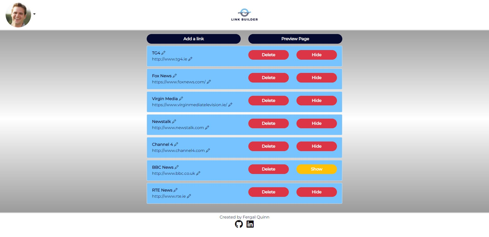

# **Link Builder**

## **Project Overview**
Linkbuilder is a full stack web application that allows users to consolodate all their links into one link. This was developed as the Milestone Project 4 for the Code Institute Diploma in Software Development. This project is based on the LinkTree web application concept. 

Companies and individuals often require one URL link to contain information/links for many other sites. In particular, Instagram allows users to have one link in Bio. Link Builder allows users create one landing link (e.g https://www.linkbuilder.com/fergalquinn) which displays all the users links.

[Deployed site](https://ci-fq-linktree-p4.herokuapp.com/)
# Table of Contents
<!-- TOC start -->
- [**Planning Phase**](#planning-phase)
  * [**Strategy** ](#strategy)
    + [**Site Aims**](#site-aims)
    + [Brainstorming](#brainstorming)
    + [Opportunities](#opportunities)
  * [**Scope**](#scope)
  * [**Structure**](#structure)
    + [**Agile Development Process**](#agile-development-process)
    + [**User Stories**  ](#user-stories)
    + [**User Stories dropped as part of the agile process**](#user-stories-dropped-as-part-of-the-agile-process)
  * [**Skeleton**](#skeleton)
    + [**Wireframes**](#wireframes)
    + [**Database Schema**](#database-schema)
  * [**Surface**](#surface)
    + [**Color scheme**](#color-scheme)
    + [**Typography**](#typography)
- [**Features**](#features)
  * [**Site Navigation**](#site-navigation)
    + [**Navbar**](#navbar)
      - [***Logo***](#logo)
      - [***Signed Out***](#signed-out)
      - [***Signed In***](#signed-in)
  * [**First Time User**](#first-time-user)
    + [***Sign-up***](#sign-up)
    + [***No Links Added Yet***](#no-links-added-yet)
    + [***Reset Password***](#reset-password)
  * [**Logged in user**](#logged-in-user)
    + [***Adding/Deleting/Updating Links***](#addingdeletingupdating-links)
    + [***Support Pages***](#support-pages)
    + [***Showing and Hiding Links***](#showing-and-hiding-links)
  * [***Footer***](#footer)
  * [**Error pages**](#error-pages)
    + [***500 Server Error Page***](#500-server-error-page)
    + [***404 Page Not Found Error Page***](#404-page-not-found-error-page)
  * [**Warning Modals**](#warning-modals)
    + [***Delete Link***](#delete-link)
- [**Future development**](#future-development)
- [**Testing Phase**](#testing-phase)
- [**Deployment**](#deployment)
- [**Technologies used**](#technologies-used)
- [**Mentions**  ](#mentions)
- [**Credits**](#credits)
<!-- TOC end -->
# **Planning Phase**
## **Strategy** 
### **Site Aims**

Companies often have many links they need to be displayed to customers. However some platforms like Instagram restrict the number of URL's that can be included in their Bio.

This app aims to provide a user and simple interface that allows them to use one single link that contains many other links.

### Brainstorming

My brother and I work in the licenced trade and have a number of venues that regularly use social media. We brainstormed what features we would find useful and have detailed these below.

### Opportunities
There was a wide range of features I came up with during our brainstorming session for this site. I used a feasibility chart to narrow them down and prioritize the scope of the intended strategy. 

Opportunity | Importance | Viability/Feasibility
---|---|---
Add/Edit/Delete links | 5 | 5
User can toggle between hide/show links | 5 | 5
User can have a unique landing page to display links | 5 | 5
User can drag and drop links to re-order | 3 | 1
Set up their profile including picture and social media links | 3 | 5 
User can review stats on how many times each link is clicked | 2 | 1
Set up a schedule for the links to be displayed | 2 | 1
----------------------------------------|----|----
Totals | 25 | 23 

Viability and feasibility in the above table are based on both time and current level of ability using different languages/frameworks. 

## **Scope**

Due to the imbalance in scores above, there will be some trade-offs. However, I anticipate that some further trade-offs will need to be made later due to the time set for this project. 

I have further divided this table into three categories to help prioritize the order of importance and clarify the MVP required to launch as a basic proof of concept while meeting the above objective. These three categories are:-
* UX efforts **must** address these:
    * Add/Edit/Delete links.
    * User can have a unique landing page to display links.
    * Set up their profile including picture and social media links.

* UX efforts **should** accommodate these:
    * User can toggle between hide/show links.
    * Support system for users

* **Unwise** use of time to address there:
    * User can drag and drop links to re-order.
    * User can review stats on how many times each link is clicked.
    * Set up a schedule for the links to be displayed.

## **Structure**

### **Agile Development Process**

I used the Agile Process for development of this web application. The user stories are detailed below. I used the Kanban board on Github to track progress. Coming to the end of this project, I became aware of some cloud based software suites that would have been most useful in tracking development progress (in particular [Craft.io](https://www.craft.io). I plan to use this for my next project.

To help me visualize a typical user journey around the site, I used [draw.io](https://app.diagrams.net/) to help me plan out the various routes a user could take through the site.

User Journey Flowchart

### **User Stories**  

* As an **Admin** I can...
    * **Access the admin interface** so that **Manually edit user and link details**    
    * ... **Filter and search all users from the admin page** so that **I can utilize the admin page to review, edit and delete user data quickly.**
    * ...**Easily navigate the admin panel** so that **I can view, search, add and delete links**
    * ...**Reply to support enquiries** so that **users can have their issues resolved**

* As an **Unregistered User** I can... 
    * ...**access a user page without the required to have an account** so that **I can access the users links and social media links**

* As a **Registered User** I can... 
    * ...**register an account** so that **I can start building my single link**
    * ...**add links** so that **build my linktree**  
    * ...**set a profile picture and company profile** so that **it gives my site a better identity**
    * ...**add, edit and delete links** so that **modify my linktree**
    * ...**Toggle a link to show or hide** so that **turn the link off and on when I need it**
    * ...**Schedule links** so that **they can automatcially appear and disappear from my page according to my schedule**
    * ...**Post support enquiries** so that **resolve problems I have**

* As a **Site User** I can...
    * ...**see appropriate responses upon specific interactions with the site** so that **I know my edit, deletion, submission has been successful.**
    * ...**Add/Edit and Delete Links** so that **I can modify the links displayed on my external page**
    * ...**Preview what my external site** so that **I can use what my single-link site will look like to customers**

### **User Stories dropped as part of the agile process**
* As a **Registered User** I can **Schedule links** so that **they can automatcially appear and disappear from my page according to my schedule**
* As a **Registered User** I can **see analytics on how many people accessed my links** so that **what links are the most popular**
* As a **Registered User** I can **drag and drop links** so that **I can easily reorder their positions on my site**

I did make a start on analytics, in that the user can see how many times their links have been clicked on. However, there is lots more analytics that can be incorporated into this app.

## **Skeleton**
### **Wireframes**

I wanted the site to be clean and simple. This is reflected in the wireframes below.
* [External Page - No Login Required](docs/wireframes/external-page-login-not-required.png)
* [Homepage - No Login Required](docs/wireframes/homepage-no-login-required.png)
* [Index Page - Login Required](docs/wireframes/index-page-login-required.png)

### **Database Schema**
Below is the ERD for my database models:  

Click here for the ERD model

 

There are 3 models used in the **Accounts App**. This app deals with user accounts/profiles and support tickets/messages. There is one model in the **Links App**. This app deal with user links.

Click here for custom models

## **Surface**
### **Color scheme**
The main colors used in the site are contained in the color grid below. I used [Contrast Eight Shapes](https://contrast-grid.eightshapes.com/) to test the background colors against the colors used for font. 

Click here for color grid

### **Typography**

For this project, I used the Montserrat font. This font was used in the Logo (designed in [Canva](http://www.canva.com)). The font is simple and not too stylised. I feel it works well for this particular project.

# **Features**
## **Site Navigation**
### **Navbar**
#### ***Logo***
The name 'Link Builder' is in keeping with the purpose of the site. I used [Canva](http://www.canva.com) to design the logo.

#### ***Signed Out***
The navbar is simple and has a clear call to action (login). The logo is centered on the navbar.The navbar allows the user to navigate the site easily. When signed out of the page, it shows the following:
* Shows link to register.
* Shows login link.

Click here for Navbar when not logged in

#### ***Signed In***
Changes to the nav bar when logged in are:

Register and Login nav items replaced with Logout and Profile. It also includes the users profile picture if they have one.     

Click here for Navbar when logged in

If the user does not have a profile picture, then the following navbar shows:

Navbar with no user profile pic

## **First Time User**
When a user lands on the root url, they are displayed with a page that lets the user know what the site is about and gives them instructions on how to progress

Homepage instructions

### ***Sign-up***
The sign-up page is simple with a color scheme in keeping with the rest of the site. It includes a cancel button in case the user does not wish to proceed. It uses the in-built django validation with an additional requirement of email address. 

I felt that ease of registration is important for the site so I incorporated Django Google Authentication using django-allauth.

Sign Up Page

### ***No Links Added Yet***

When a user has no links and is on their homepage (logged-in), they are displayed with a simple message on how to start using the site.

Site Instructions

### ***Reset Password***

A user can reset their password on login.

Password Reset

When the user clicks on this link, they are asked for their email address

Password Reset Form

Once they enter their email, a message is displayed

Email Sent

The email to the user with link to progress password reset is below

Reset Password Email

Once the user clicks on the link, they are brought to the following page

Enter New Password

Once they provide new password details, they are brought to the final screen

Change Complete

## **Logged in user**

When a user is logged in and has links/data added, they are displayed with a list of their links on the homepage:

Instructions

It gives the user full CRUD ability and also allows them to preview what their external page will look like. When the user clicks on the 'Preview Page' button - a preview of their external 'single link' site shows

Preview Page

### ***Adding/Deleting/Updating Links***

Adding/Editing a Link

The user is displayed with a simple interface for entering a new link or editing an existing link.

Add a link

Edit a link

There is **validation** for both forms on the url entered. It checks for a 200 response and gives an error message if this is not received (i.e. not a valid URL)

Invalid URL

### ***Support Pages***

If the user is having trouble, there is a support page where they can post a query.

Support Page

When the user has posted a support ticket, they can view responses to the query on the ticket page

Ticket Page

### ***Showing and Hiding Links***

The user can choose to show or hide each link on the homepage by clicking the 'show' or 'hide' button. A spinner appears when the button is click until the page is loaded

Spinner

If a user trys to edit/delete/toggle another users links, the following message shows:

No Access

## ***Footer***
* Displays social media links to contact the author.  

Footer

## **Error pages**

### ***500 Server Error Page***
I created a basic 500 & 404 page with button to bring the user back to the homepage.

500 Error Page

### ***404 Page Not Found Error Page***
This error shows when a user types a URL into the browser which does not exist within the app's domain.

404 Error Page

## **Warning Modals**
### ***Delete Link***

Delete Warning Link

# **Future development**
* I would like to incorporate drag and drop functionality for the ordering of links. I have come across a couple of JQuery solutions that should help here like [Sortable](https://jqueryui.com/sortable/).
* Analytics feature, providing the user with more detailed insights on link clicks. 

# **Testing Phase**
I have included testing details during and post-development in a separate document called [TESTING.md](TESTING.md).

# **Deployment**
The final Deployed site can be found [here](https://ci-fq-linktree-p4.herokuapp.com/)
I have included details of my initial deployment in a separate document called [DEPLOYMENT.md](DEPLOYMENT.md).

# **Technologies used**
* Python
  * The packages installed for the is project can be found in [the requirements.txt](requirements.txt)
* Django
  * Django was used as the python framework in the project.
  * Django all auth was used to handle user authentication and related tasks i.e. sign in, sign up, sign out.
* Heroku
  * Used to deploy the page and make it publicly available.
* Heroku PostgreSQL
  * Used for the database during development and in deployment.
* HTML
  * HTML was the base language used to layout the skeleton of all templates.
* CSS
  * Custom CSS used to style the page and make the appearance look a little more unique.
* Bootstrap 4.6.1
  * Used for the majority of styling throughout the document and for it's fantastic grid system. 
* Font awesome
  * All icons throughout the page.

# **Mentions**  
* My mentor Chris Quinn and the CI Tutor Team. Chris once again gave great guidance. The Menotor Team (in particular Alex, Ger and Ed who I was in touch with quite alot) were fantastic as always and putting me on the right track when I hit a problem. 

# **Credits**
* Balsamiq was used to create the wireframes.
* The site was developed using Gitpod.
* GitHub was used to store my repository.
* Responsive screenshot made using [Am I responsive](https://ui.dev/amiresponsive)
* Fonts were taken from [Google Fonts](https://fonts.google.com/)
* Color Selection [Eight Shapes]((https://contrast-grid.eightshapes.com/))
* Logo and landing page image were created on [Canva](https://www.canva.com) 
* General references:
    * [Geeks for Geeks](https://www.geeksforgeeks.org/)
    * [Stack Overflow](https://stackoverflow.com/)
    * [Code Institute Learning Platform](https://codeinstitute.net/)
    * [Django Documentation](https://docs.djangoproject.com/en/3.2/)
    * [Bootstrap Documentation](https://getbootstrap.com/)
    * [Corey Schlafer](https://www.youtube.com/c/Coreyms)
    * [Codemy](https://www.youtube.com/c/Codemycom)
* [DNLBowers](https://github.com/dnlbowers/jobs-a-gooden) - A great template for Readme