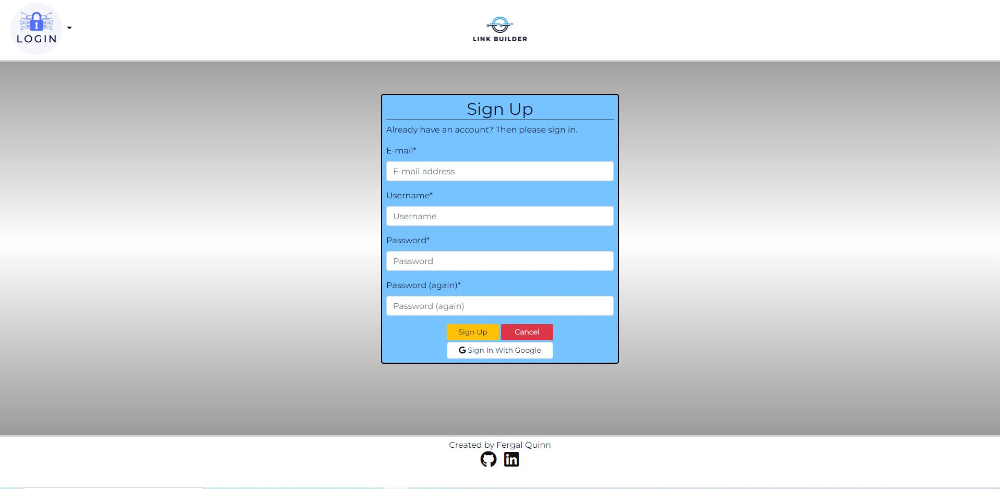

# **Link Builder**
This project is based on the LinkTree web application concept. Companies and individuals often require one URL link to contain information/links for many other sites. In particular, Instagram allows users to have one link in Bio.

Link Builder allows users create one landing link (https://www.linkbuilder.com/username) which displays all the users links.

[Deployed site](https://ci-fq-linktree-p4.herokuapp.com/)

# **Planning Phase**
## **Strategy** 
### **Site Aims:**

Companies often have many links they need to be displayed to customers. However some platforms like Instagram restrict the number of URL's that can be included in their Bio.

This app aims to provide a user and simple interface that allows them to use one single link that contains many other links.

### Brainstorming:

My brother and I work in the licenced trade and have a number of venues that regularly use social media. We brainstormed what features we would find useful and have detailed these below.

### Opportunities:
There was awide range of features I came up with during our brainstorming session for this site. I used a feasibility chart to narrow them down and prioritize the scope of the intended strategy. 

Opportunity | Importance | Viability/Feasibility
---|---|---
Add/Edit/Delete links | 5 | 5
User can toggle between hide/show links | 5 | 5
User can have a unique landing page to display links | 5 | 5
User can drag and drop links to re-order | 5 | 3
Set up their profile including picture and social media links | 4 | 5 
User can review stats on how many times each link is clicked | 3 | 1
Set up a schedule for the links to be displayed | 3 | 2
----------------------------------------|----|----
Totals | 30 | 26 

Viability and feasibility in the above table are based on both time and current level of ability using different languages/frameworks. 

## **Scope**

Due to the imbalance in scores above, there will be some trade-offs. However, I anticipate that some further trade-offs will need to be made later due to the time set for this project. 

I have further divided this table into three categories to help prioritize the order of importance and clarify the MVP required to launch as a basic proof of concept while meeting the above objective. These three categories are:-
* UX efforts **must** address these:
    * Add/Edit/Delete links.
    * User can have a unique landing page to display links.
    * Set up their profile including picture and social media links.

* UX efforts **should** accommodate these:
    * User can toggle between hide/show links.

* **Unwise** use of time to address there:
    * User can drag and drop links to re-order.
    * User can review stats on how many times each link is clicked.
    * Set up a schedule for the links to be displayed.

## **Structure**   
To help me visualize a typical user journey around the site, I used [draw.io](https://app.diagrams.net/) to help me plan out the various routes a user could take through the site.

### **User Stories:**  

* As an **Admin** I can...
    * **Access the admin interface** so that **Manually edit user and link details**    
    * ... **Filter and search all users from the admin page** so that **I can utilize the admin page to review, edit and delete user data quickly.**
    * ...**Easily navigate the admin panel** so that **I can view, search, add and delete links**

* As an **Unregistered User** I can... 
    * ...**access a user page without the required to have an account** so that **I can access the users links and social media links**

* As a **Registered User** I can... 
    * ...**register an account** so that **I can start building my single link**
    * ...**add links** so that **build my linktree**  
    * ...**set a profile picture and company profile** so that **it gives my site a better identity**
    * ...**add, edit and delete links** so that **modify my linktree**
    * ...**Toggle a link to show or hide** so that **turn the link off and on when I need it**
    * ...**Schedule links** so that **they can automatcially appear and disappear from my page according to my schedule**

* As a **Site User** I can...
    * ...**see appropriate responses upon specific interactions with the site** so that **I know my edit, deletion, submission has been successful.**
    * ...**Add/Edit and Delete Links** so that **I can modify the links displayed on my external page**
    * ...**Preview what my external site** so that **I can use what my single-link site will look like to customers**

### **User Stories dropped as part of the agile process**
* As a **Registered User** I can **Schedule links** so that **they can automatcially appear and disappear from my page according to my schedule**
* As a **Registered User** I can **see analytics on how many people accessed my links** so that **what links are the most popular**
* As a **Registered User** I can **drag and drop links** so that **I can easily reorder their positions on my site**

## **Skeleton**
### **Wireframes:**
* [External Page - No Login Required](docs/wireframes/external-page-login-not-required.png)
* [Homepage - No Login Required](docs/wireframes/homepage-no-login-required.png)
* [Index Page - Login Required](docs/wireframes/index-page-login-required.png)

I added a hero image to each page during development and made the Job Opening page the home page. I added some forms to edit notes/insights and add a job; however, these were last-minute additions and were a simple form alone on the page. I deemed there were no wireframes required for these.

### **Database Schema**
Below is the simple relationship diagram for my database tables:  
 

The entity relationship diagram is quite simple. I use the build in User model combined with a profile model. There is a link model with a one to zero or many relationship User -> Links.

## **Surface**
### **Color scheme:**
The main colors used in the site are contained in the color grid below. I used [Contrast Eight Shapes](https://contrast-grid.eightshapes.com/) to test the background colors against the colors used for font. 

### **Typography**:

For this project, I used the Montserrat font. This font was used in the Logo (designed in [Canva](http://www.canva.com)). The font is simple and not too stylised. I feel it works well for this particular project.

# **Agile Development Process**
I used the Agile Process for development of this web application. 

# **Features**
## **Site Navigation**
### **Navbar**
#### ***Logo:***
The name 'Link Builder' is in keeping with the purpose of the site. I used [Canva](http://www.canva.com) to design the logo.

#### ***Signed Out:***
The navbar is simple and has a clear call to action (login). The logo is centered on the navbar.The navbar allows the user to navigate the site easily. When signed out of the page, it shows the following:
* Shows link to register.
* Shows login link.

#### ***Signed In:***
Changes to the nav bar when logged in are:

Register and Login nav items replaced with Logout and Profile. It also includes the users profile picture if they have one.     

If the user does not have a profile picture, then the following navbar shows:

### **First Time User:**
When a user lands on the root url, they are displayed with a page that lets the user know what the site is about and gives them instructions on how to progress

#### ***Register Page***
The sign-up page is simple with a color scheme in keeping with the rest of the site. 

#### ***No Links Added Yet***

When a user has no links and is on their homepage (logged-in), they are displayed with a simple message on how to start using the site.

### **Logged in user:**

When a user is logged in and has links/data added, they are displayed with a list of their links on the homepage:

It gives the user full CRUD ability and also allows them to preview what their external page will look like. When the user clicks on the 'Preview Page' button - a preview of their external 'single link' site shows

#### ***Adding/Deleting/Updating Links***

Adding/Editing a Link

The user is displayed with a simple interface for entering a new link or editing an existing link.

There is **validation** for both forms on the url entered. It checks for a 200 response and gives an error message if this is not received (i.e. not a valid URL)

### ***Footer:***
* Displays social media links to contact the author.  

## **Error pages**

### ***500 Server Error Page:***
I created a basic 500 & 404 page with button to bring the user back to the homepage.

### ***404 Page Not Found Error Page:***
This error shows when a user types a URL into the browser which does not exist within the app's domain.

## **Warning Modals**
### ***Delete Link:***

# **Future development**
* I would like to incorporate drag and drop functionality for the ordering of links. I have come across a couple of JQuery solutions that should help here like [Sortable](https://jqueryui.com/sortable/).
* Include social media login (Facebook/Google).
* Reset password feature.
* Analytics feature, providing the user with detailed insights on link clicks. 

# **Testing Phase**
I have included testing details during and post-development in a separate document called [TESTING.md](TESTING.md).

# **Deployment**
The final Deployed site can be found [here](https://ci-fq-linktree-p4.herokuapp.com/)
I have included details of my initial deployment in a separate document called [DEPLOYMENT.md](DEPLOYMENT.md).

# **Technologies used**
* Python
  * The packages installed for the is project can be found in [the requirements.txt](requirements.txt)
* Django
  * Django was used as the python framework in the project.
  * Django all auth was used to handle user authentication and related tasks i.e. sign in, sign up, sign out.
* Heroku
  * Used to deploy the page and make it publicly available.
* Heroku PostgreSQL
  * Used for the database during development and in deployment.
* HTML
  * HTML was the base language used to layout the skeleton of all templates.
* CSS
  * Custom CSS used to style the page and make the appearance look a little more unique.
* Bootstrap 4.6.1
  * Used for the majority of styling throughout the document and for it's fantastic grid system. 
* Font awesome
  * All icons throughout the page.

# Mentions  
* My mentor Chris Quinn and the CI Tutor Team. Chris once again gave great guidance. The Menotor Team (in particular Alex, Ger and Ed who I was in touch with quite alot) were fantastic as always and putting me on the right track when I hit a problem. 

# Credits
* Balsamiq was used to create the wireframes.
* The site was developed using Gitpod.
* GitHub was used to store my repository.
* Responsive screenshot made using [Am I responsive](https://ui.dev/amiresponsive)
* Fonts were taken from [Google Fonts](https://fonts.google.com/)
* Color Selection [Eight Shapes]((https://contrast-grid.eightshapes.com/))
* Logo and landing page image were created on [Canva](https://www.canva.com) 
* General references:
    * [Geeks for Geeks](https://www.geeksforgeeks.org/)
    * [Stack Overflow](https://stackoverflow.com/)
    * [Code Institute Learning Platform](https://codeinstitute.net/)
    * [Django Documentation](https://docs.djangoproject.com/en/3.2/)
    * [Bootstrap Documentation](https://getbootstrap.com/)
    * [Corey Schlafer](https://www.youtube.com/c/Coreyms)
    * [Codemy](https://www.youtube.com/c/Codemycom)
* [DNLBowers](https://github.com/dnlbowers/jobs-a-gooden) - A great template for Readme