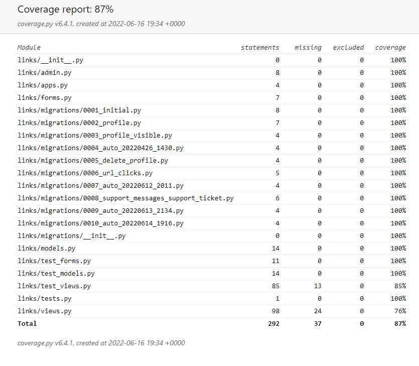
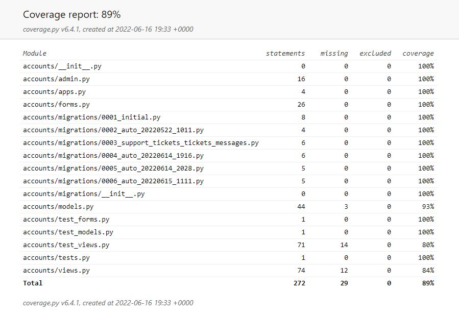

# Table of Contents 

<!-- TOC start -->
- [Validator Testing](#validator-testing)
  * [Lighthouse Reports](#lighthouse-reports)
    + [No Login Required ](#no-login-required)
      - [Sign-in](#sign-in)
      - [Sign-up](#sign-up)
      - [External Homepage](#external-homepage)
      - [Root Page](#root-page)
    + [Login Required](#login-required)
      - [Index Page (Links)](#index-page-links)
      - [Add A Link](#add-a-link)
      - [Edit A Link](#edit-a-link)
  * [CSS Checks](#css-checks)
  * [HTML Checks](#html-checks)
  * [PEP8 Testing](#pep8-testing)
  * [Javascript Testing](#javascript-testing)
- [Manual testing](#manual-testing)
  * [User Actions](#user-actions)
  * [User Stories](#user-stories)
    + [As an **Admin** I can...](#as-an-admin-i-can)
    + [As an **Unregistered User** I can...](#as-an-unregistered-user-i-can)
    + [As a **Site User** I can...](#as-a-site-user-i-can)
  * [Unitesting](#unitesting)
- [Further Testing](#further-testing)
<!-- TOC end -->

# Validator Testing

## Lighthouse Reports

The lighthouse tests show good results for all pages for accessability. There were a number of contrast score issues which were rectified. Mobile scores were slightly lower than desktop in performance for two main reasons - cdn imports from bootstrap and jquery. 

### No Login Required 
#### **Sign-in**

Mobile

Desktop

#### **Sign-up**

Mobile

Desktop

#### **External Homepage**

Mobile

Desktop

#### **Root Page**

Mobile

Desktop

### Login Required
#### **Index Page (Links)**

Mobile

Desktop

#### **Add A Link**

Mobile

Desktop

#### **Edit A Link**

Mobile

Desktop

## CSS Checks
I tested my static CSS file using [W3C Validator](https://jigsaw.w3.org/css-validator) and found it to be free from errors.

    

## HTML Checks
No errors were found when passing through the official [W3C validator](https://validator.w3.org/#validate_by_input).

## PEP8 Testing
I ran the [PEP8 Validator](http://pep8online.com/) on all .py files and all past.

## Javascript Testing
I passed the Javascript through the [JSHint Validator](https://jshint.com/). The only warning related to using 'ES6'.

# Manual testing
## User Actions

|     | User Actions           | Expected Results | Y/N | Comments    |
|-------------|------------------------|------------------|------|-------------|
| Root/Homepage     |                        |                  |      |             |
| 1           | Click on Sign Up button | Redirection to Sign Up page | Y |          |
| 2           | Click on the login button | Redirection to Login page | Y |          |
| Sign-up  
| 3           | Enter valid email | Field will only accept email address format + unique email | Y |          |
| 4           | Enter valid username | Field will only accept unique username | Y |          |
| 5           | Cancel button works | Redirects to page previously on | Y 
| 6           | Sign-up with Google works | User is able to sign-up with Google | Y 
|          |
| Main Index Page
| 7          | Add A Link button works | Redirects to add a link page | Y |          |
| 8          | Preview Page button works | Redirects to external customer page | Y |          |
| 9          | Delete button works  | Takes user to screen to confirm deletion | Y |          |
|  10         | Show/Hide button works | Toggles between showing and hiding links | Y |          |
| 11          | Edit button works | Takes user to edit link page | Y | |
| External Customer Page
| 12          | Link boxes work | They take customer to url as inputed by user  | Y |          |
| 13          | Social Media buttons work| Redirect to social media links as per user profile | Y |          |
| Support Page
| 14         | Post Support Ticket | User can [post a support ticket](docs/images/user-test-support-ticket.jpg)  | Y |          |
| 15          | Can send further messages| Can [post further messages](docs/images/user-test-support-message.jpg) about ticket | Y |          |

## Security

It should be the case that only the logged in user can add/edit/delete their own links and not others users links. This also applies to all other models. I manually tested each model using two usernames - namely, **user1** and **user2** 

|     | User Actions           | Expected Results | Y/N | Comments    |
|-------------|------------------------|------------------|------|-------------|
| Links Model     |                        |                  |      |             |
| 1           | **user2** cannot edit **user1** link  |   Do Not Have Access message | Y |          |
| 2           | **user2** cannot delete **user1** link | Do Not Have Access message | Y |          |
| Support Ticket  
| 3           | **user2** cannot view **user1** support tickets | Do Not Have Access message | Y |          |
| 4           | **user2** cannot view mark **user1** support tickets as resolved | Do Not Have Access message | Y |          |

If user2 cannot access user1 supports tickets - then they cannot post ticket_messages either (another model). user2 also does not have access to user1 profile so cannot change details on it.

## User Stories
### As an **Admin** I can...

Here I have only tested the admin panel relating to the links and profile apps.

| Checked | ...**Access the admin interface** so that **Manually edit user and link details** |
|:-------:|:--------|
| &check; | Can edit [user profile details](docs/images/admin-edit-profile-details.jpg) and [links](docs/images/admin-edit-link-details.jpg) |

| Checked | ...**Filter and [search all users](docs/images/admin-search-users.jpg) from the admin page** so that **I can utilize the admin page to review, edit and delete user data quickly.** |
|:-------:|:--------|
| &check; | Can filter users - [search by username](docs/images/admin-filter-users.jpg) |
| &check; | Can filter links - [search by link title](docs/images/admin-filter-links.jpg) |

| Checked | ...**Easily navigate the admin panel** so that **I can view, search, add and delete links** |
|:-------:|:--------|
| &check; | Can search links |
| &check; | Can create, edit and delete links |

| Checked | ...**[Reply to support enquiries](docs/images/admin-response-support-query.jpg)** so that **users can have their issues resolved** |
|:-------:|:--------|
| &check; | Can view user support queries posted in the admin panel |
| &check; | Can reply to user support queries in the admin panel |

### As an **Unregistered User** I can...

| Checked | ...**access a user page without the required to have an account** so that **I can access the users links and social media links** |
|:-------:|:--------|
| &check; | When not logged-in, when I enter the root web-address, I am brought to a page introducing the website and giving sign-up/sign-in options  |

### As a **Site User** I can...
| Checked | ...**see appropriate responses upon specific interactions with the site** so that **I know my edit, deletion, submission has been successful.** |
|:-------:|:--------|
| &check; | On deletion of a link, I am prompted 'Are you sure you want to delete the link  |
| &check; | After deleting the link, the user is presented with an updated page with the link deleted  |

| Checked | ...**Add/Edit and Delete Links** so that **I can modify the links displayed on my external page** |
|:-------:|:--------|
| &check; | I can add links  |
| &check; | I can update links  |
| &check; | I can delete links  |

| Checked | ...**Preview what my external site** so that **I can use what my single-link site will look like to customers** |
|:-------:|:--------|
| &check; | I can view my external site that displays my links  |

| Checked | ...**not edit/delete/toggle links of other users** so that **only users who created the links, can edit/delete/toggle them** |
|:-------:|:--------|
| &check; | I cannot edit a link of another user  |
| &check; | I cannot delete the link of another user  |
| &check; | I cannot toggle the link of another user  |

| Checked | ...**Post support enquiries** so that **resolve problems I have** |
|:-------:|:--------|
| &check; | I can post a support ticket  |
| &check; | I can post further messages relating to my support ticket  |

## Unitesting

I used Django's unitesting and ran tests to have coverage of over 80% on both app's. Here are the results:

Click here to view unit testing for Links App

Click here to view unit testing for Accounts App

# Further Testing

- I tested that the page works in the different browsers: [Chrome](docs/images/chrome.jpg), [Safari](assets/images/game-safari-display.jpg), [Firefox](docs/images/firefox.jpg).
- I confirmed that this project is [responsive](docs/images/responsive.jpg), looks good and functions on all standard screen sizes using devtools device toolbar.
- I confirmed all buttons are working right, executing the correct functions and displaying results correctly on the screen.

[Back to Readme](README.md)