## Bugs and Fixes During the Development Process


# Lighthouse


## No Login Required 
### Sign-in:
#### Mobile
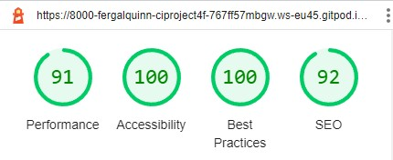
#### Desktop
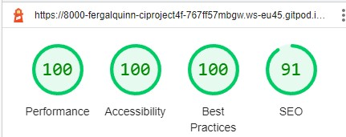
### Sign-up:
#### Mobile
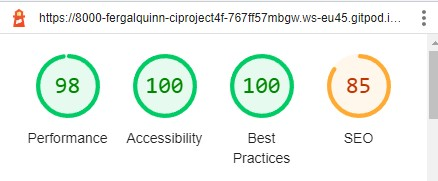
#### Desktop
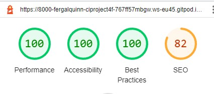
### External Homepage:
#### Mobile
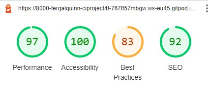
#### Desktop

### Root Page:
#### Mobile
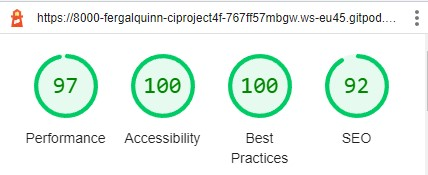
#### Desktop
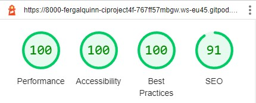
## Sign-Login Required
### Index Page (Links)
#### Mobile

#### Desktop
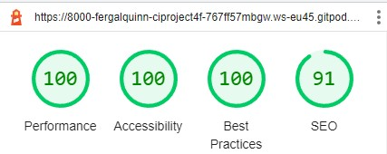
### Add A Link
#### Mobile
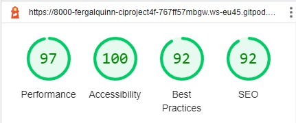
#### Desktop

### Edit A Link
#### Mobile
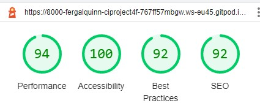
#### Desktop
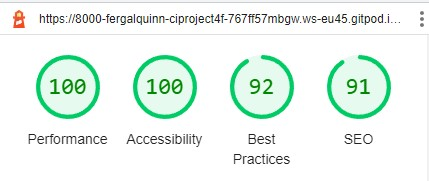


## [CSS](https://jigsaw.w3.org/css-validator/):
Checking by URL there were a lot of errors coming from the bootstrap and font awesome source code.  However my CSS file was tested by direct upload was found to be free from errors
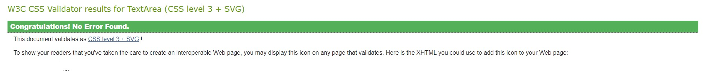
<p>
    <a href="http://jigsaw.w3.org/css-validator/check/referer">
        
    </a>
</p>

## [PEP8](http://pep8online.com):
Before using the pep8 validator I ran ``` autopep8 --in-place --aggressive --aggressive <file name> ``` on all py files.  

Due to this, the only error I found was in settings.py with ``` AUTH_PASSWORD_VALIDATORS ``` & ``` STATICFILES_STORAGE ```.   

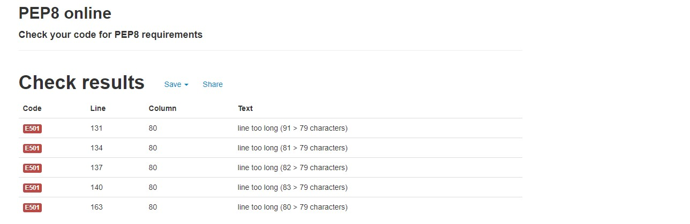 

The first appears to be a long-standing issue with using the pep8 checker with Django. However, Django seems to think shortening these lines is ill advisable. For this reason, I left them to be longer than 80 characters. 

# Manual testing
Below is a summary of how I manually tested each user story.

## As an **Admin** I can...

Here I have only tested the admin panel relating to the links and profile apps.

| Checked | ...**Access the admin interface** so that **Manually edit user and link details** |
|:-------:|:--------|
| &check; | Can edit user details and links |

| Checked | ...**Filter and search all users from the admin page** so that **I can utilize the admin page to review, edit and delete user data quickly.** |
|:-------:|:--------|
| &check; | Can filter users - search by username |
| &check; | Can filter links - search by link title |

| Checked | ...**Easily navigate the admin panel** so that **I can view, search, add and delete links** |
|:-------:|:--------|
| &check; | Can search links |
| &check; | Can create, edit and delete links |

## As an **Unregistered User** I can...

| Checked | ...**access a user page without the required to have an account** so that **I can access the users links and social media links** |
|:-------:|:--------|
| &check; | When not logged-in, when I enter the root web-address, I am brought to a page introducing the website and giving sign-up/sign-in options  |

## As a **Site User** I can...
| Checked | ...**see appropriate responses upon specific interactions with the site** so that **I know my edit, deletion, submission has been successful.** |
|:-------:|:--------|
| &check; | On deletion of a link, I am prompted 'Are you sure you want to delete the link  |
| &check; | After deleting the link, the user is presented with an updated page with the link deleted  |

| Checked | ...**Add/Edit and Delete Links** so that **I can modify the links displayed on my external page** |
|:-------:|:--------|
| &check; | I can add links  |
| &check; | I can update links  |
| &check; | I can delete links  |

| Checked | ...**Preview what my external site** so that **I can use what my single-link site will look like to customers** |
|:-------:|:--------|
| &check; | I can view my external site that displays my links  |

| Checked | ...**not edit/delete/toggle links of other users** so that **only users who created the links, can edit/delete/toggle them** |
|:-------:|:--------|
| &check; | I cannot edit a link of another user  |
| &check; | I cannot delete the link of another user  |
| &check; | I cannot toggle the link of another user  |

[Back to Readme](README.md)