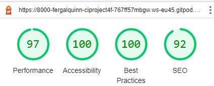
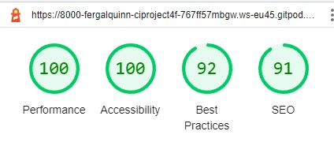

# Table of Contents 

<!-- TOC start -->
- [Lighthouse Reports](#lighthouse-reports)
  * [No Login Required ](#no-login-required)
    + [Sign-in:](#sign-in)
      - [Mobile](#mobile)
      - [Desktop](#desktop)
    + [Sign-up:](#sign-up)
      - [Mobile](#mobile-1)
      - [Desktop](#desktop-1)
    + [External Homepage:](#external-homepage)
      - [Mobile](#mobile-2)
      - [Desktop](#desktop-2)
    + [Root Page:](#root-page)
      - [Mobile](#mobile-3)
      - [Desktop](#desktop-3)
  * [Sign-Login Required](#sign-login-required)
    + [Index Page (Links)](#index-page-links)
      - [Mobile](#mobile-4)
      - [Desktop](#desktop-4)
    + [Add A Link](#add-a-link)
      - [Mobile](#mobile-5)
      - [Desktop](#desktop-5)
    + [Edit A Link](#edit-a-link)
      - [Mobile](#mobile-6)
      - [Desktop](#desktop-6)
  * [CSS Checks](#css-checks)
  * [PEP8 Testing](#pep8-testing)
- [Manual testing](#manual-testing)
  * [As an **Admin** I can...](#as-an-admin-i-can)
  * [As an **Unregistered User** I can...](#as-an-unregistered-user-i-can)
  * [As a **Site User** I can...](#as-a-site-user-i-can)
- [Further Testing](#further-testing)
<!-- TOC end -->

# Validator Testing

## Lighthouse Reports

The lighthouse tests show good results for all pages for accessability. There were a number of contrast score issues which were rectified. Mobile scores were slightly lower than desktop in performance for two main reasons - cdn imports from bootstrap and jquery. 

### No Login Required 
#### Sign-in:
- Mobile

- Desktop

#### Sign-up:
- Mobile

- Desktop

#### External Homepage:
- Mobile

- Desktop

#### Root Page:
- Mobile

- Desktop

### Sign-Login Required
#### Index Page (Links)
- Mobile

- Desktop

#### Add A Link
- Mobile

- Desktop

#### Edit A Link
- Mobile

- Desktop

## CSS Checks
I tested my static CSS file using [W3C Validator](https://jigsaw.w3.org/css-validator) and found it to be free from errors.

    

## HTML Checks
No errors were found when passing through the official [W3C validator](https://validator.w3.org/#validate_by_input). Here are the results of each page - [Homepage](assets/images/index-html-check.jpg), [Contact-Us](assets/images/contact-us-html-check.jpg), [Gallery](assets/images/gallery-html-check.jpg).

## PEP8 Testing
I ran the pep8 validator on all .py files and all past.

# Manual testing
Below is a summary of how I manually tested each user story.

Usability was tested with the below user acceptance testing, sent to new users to ensure testing from different users, on different devices and browsers to ensure issues were caught and where possible fixed during development.

|     | User Actions           | Expected Results | Y/N | Comments    |
|-------------|------------------------|------------------|------|-------------|
| Root/Homepage     |                        |                  |      |             |
| 1           | Click on Sign Up button | Redirection to Sign Up page | Y |          |
| 2           | Click on the login button | Redirection to Login page | Y |          |
| Sign-up  
| 3           | Enter valid email | Field will only accept email address format + unique email | Y |          |
| 4           | Enter valid username | Field will only accept unique username | Y |          |
| 5           | Cancel button works | Redirects to page previously on | Y |          |
| Main Index Page
| 6          | Add A Link button works | Redirects to add a link page | Y |          |
| 7          | Preview Page button works | Redirects to external customer page | Y |          |
| 8          | Delete button works  | Takes user to screen to confirm deletion | Y |          |
|  9         | Show/Hide button works | Toggles between showing and hiding links | Y |          |
| 10          | Edit button works | Takes user to edit link page | Y | |
| External Customer Page
| 11          | Link boxes work | They take customer to url as inputed by user  | Y |          |
| 12          | Social Media buttons work| Redirect to social media links as per user profile | Y |          |

## As an **Admin** I can...

Here I have only tested the admin panel relating to the links and profile apps.

| Checked | ...**Access the admin interface** so that **Manually edit user and link details** |
|:-------:|:--------|
| &check; | Can edit user details and links |

| Checked | ...**Filter and search all users from the admin page** so that **I can utilize the admin page to review, edit and delete user data quickly.** |
|:-------:|:--------|
| &check; | Can filter users - search by username |
| &check; | Can filter links - search by link title |

| Checked | ...**Easily navigate the admin panel** so that **I can view, search, add and delete links** |
|:-------:|:--------|
| &check; | Can search links |
| &check; | Can create, edit and delete links |

## As an **Unregistered User** I can...

| Checked | ...**access a user page without the required to have an account** so that **I can access the users links and social media links** |
|:-------:|:--------|
| &check; | When not logged-in, when I enter the root web-address, I am brought to a page introducing the website and giving sign-up/sign-in options  |

## As a **Site User** I can...
| Checked | ...**see appropriate responses upon specific interactions with the site** so that **I know my edit, deletion, submission has been successful.** |
|:-------:|:--------|
| &check; | On deletion of a link, I am prompted 'Are you sure you want to delete the link  |
| &check; | After deleting the link, the user is presented with an updated page with the link deleted  |

| Checked | ...**Add/Edit and Delete Links** so that **I can modify the links displayed on my external page** |
|:-------:|:--------|
| &check; | I can add links  |
| &check; | I can update links  |
| &check; | I can delete links  |

| Checked | ...**Preview what my external site** so that **I can use what my single-link site will look like to customers** |
|:-------:|:--------|
| &check; | I can view my external site that displays my links  |

| Checked | ...**not edit/delete/toggle links of other users** so that **only users who created the links, can edit/delete/toggle them** |
|:-------:|:--------|
| &check; | I cannot edit a link of another user  |
| &check; | I cannot delete the link of another user  |
| &check; | I cannot toggle the link of another user  |

# Further Testing

- I tested that the page works in the different browsers: [Chrome](docs/images/chrome.jpg), [Safari](assets/images/game-safari-display.jpg), [Firefox](docs/images/firefox.jpg).
- I confirmed that this project is [responsive](docs/images/responsive.jpg), looks good and functions on all standard screen sizes using devtools device toolbar.
- I confirmed all buttons are working right, executing the correct functions and displaying results correctly on the screen.

[Back to Readme](README.md)